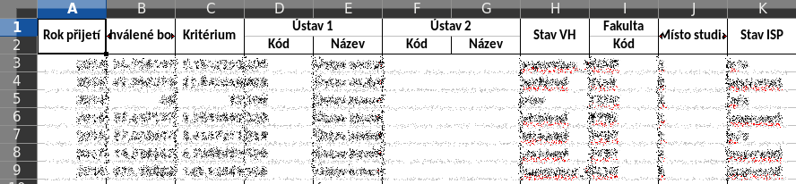

# JSON to excel converter

[](https://github.com/oarepo/json-excel-converter/blob/master/LICENSE)
[](https://travis-ci.org/oarepo/json-excel-converter)
[](https://coveralls.io/r/oarepo/json-excel-converter)
[](https://pypi.org/pypi/json-excel-converter)

A package that converts json to CSV, excel or other table formats

## Sample output



### Simple json

```json
[
  {
    "col1": "val1",
    "col2": "val2" 
  }
]
```

the generated CSV/excel is:

```
col1          col2
==================
val1          val2
```

### Nested json

```json
[
  {
    "col1": "val1",
    "col2": {
      "col21": "val21",
      "col22": "val22"
    }
  }
]
```

the generated CSV/excel is (in excel, col2 spans two cells horizontally):

```
col1          col2
              col21         col22
=================================
val1          val21         val22
```

### json with array property

```json
[
  {
    "col1": "val1",
    "col2": [
      {
        "col21": "val21"
      },
      {
        "col21": "val22"
      }
    ]
  }
]
```

the generated CSV/excel is (in excel, col2 spans two cells horizontally):

```
col1          col2         
              col21         col21
=================================
val1          val21         val22
```


## Installation

```bash
pip install json-excel-converter[extra]
```

where extra is:

 * ``xlsxwriter`` to use the xlsxwriter

## Usage

### Simple usage

```python

from json_excel_converter import Converter 
from json_excel_converter.xlsx import Writer

data = [
    {'a': [1], 'b': 'hello'},
    {'a': [1, 2, 3], 'b': 'world'}
]

conv = Converter()
conv.convert(data, Writer(file='/tmp/test.xlsx'))
```

### Streaming usage with restarts

```python

from json_excel_converter import Converter, LinearizationError 
from json_excel_converter.csv import Writer

conv = Converter()
writer = Writer(file='/tmp/test.csv')
while True:
    try:
        data = get_streaming_data()     # custom function to get iterator of data
        conv.convert_streaming(data, writer)
        break
    except LinearizationError:
        pass
```

### Arrays

When the first row is processed, the library guesses the columns layout. In case of arrays,
a column (or more columns if the array contains json objects) is created for each
of the items in the array, as shown in the example above.

On subsequent rows the array might contain more items. The library reacts by adjusting 
the number of columns in the layout and raising ``LinearizationError`` as previous rows might
be already output.

``Converter.convert_streaming`` just raises this exception - it is the responsibility of caller
to take the right action.

``Converter.convert`` captures this error and restarts the processing. In case of CSV
this means truncating the output file to 0 bytes and processing the data again. XLSX writer
caches all the data before writing them to excel so the restart just means discarding the cache.

If you know the size of the array in advance, you should pass it in options. Then no
processing restarts are required and ``LinearizationError`` is not raised.

 ```python

from json_excel_converter import Converter, Options
from json_excel_converter.xlsx import Writer

data = [
    {'a': [1]},
    {'a': [1, 2, 3]}
]
options = Options()
options['a'].cardinality = 3

conv = Converter(options=options)
writer = Writer(file='/tmp/test.xlsx')
conv.convert(data, writer)
# or
conv.convert_streaming(data, writer)    # no exception occurs here
```

### XLSX Formatting

#### Cell format

XLSX writer enables you to format the header and data by passing an array of header_formatters or
data_formatters. Take these from ``json_excel_converter.xlsx.formats`` package or create your own.

```python
from json_excel_converter import Converter

from json_excel_converter.xlsx import Writer
from json_excel_converter.xlsx.formats import LastUnderlined, Bold, \
    Centered, Format

data = [
    {'a': 'Hello'},
    {'a': 'World'}
]

w = Writer('/tmp/test3.xlsx',
           header_formats=(
               Centered, Bold, LastUnderlined,
               Format({
                   'font_color': 'red'
               })),
           data_formats=(
               Format({
                   'font_color': 'green'
               }),)
           )

conv = Converter()
conv.convert(data, w)
```

See https://xlsxwriter.readthedocs.io/format.html for details on formats in xlsxwriter

#### Column widths

Pass the required column widths to writer:

```python
w = Writer('/tmp/test3.xlsx', column_widths={
    'a': 20
})
```

Width of nested data can be specified as well: 

```python
data = [
    {'a': {'b': 1, 'c': 2}}
]

w = Writer('/tmp/test3.xlsx', column_widths={
    'a.b': 20,
    'a.c': 30,
})
```


To set the default column width, pass it as ``DEFAULT_COLUMN_WIDTH`` property:

```python
w = Writer('/tmp/test3.xlsx', column_widths={
    DEFAULT_COLUMN_WIDTH: 20
})
```

#### Row heights

Row heights can be specified via the ``row_heights`` writer option:

```python
w = Writer('/tmp/test3.xlsx', row_heights={
    DEFAULT_ROW_HEIGHT: 20,     # a bit taller rows
    1: 40                       # extra tall header
})
```
